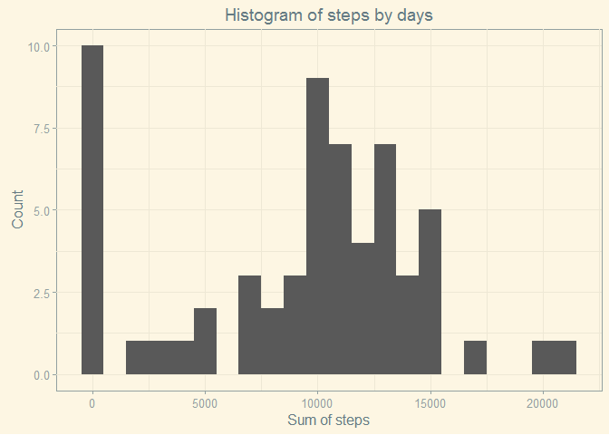
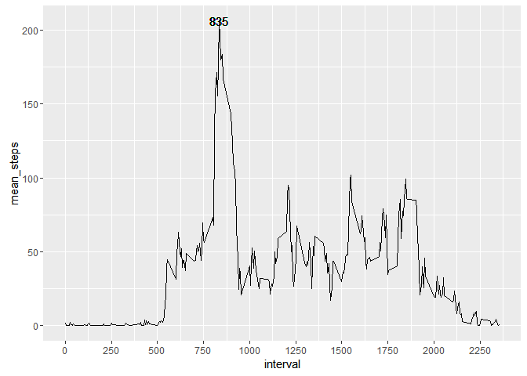
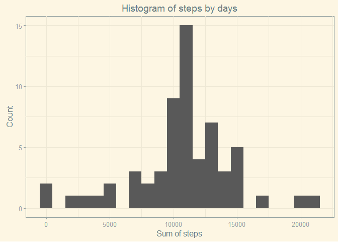
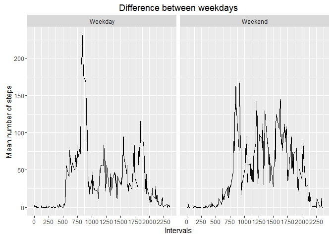

# Reproducible Research: Peer Assessment 1
Aram Fomichev  
First, let's load all the necessary libraries

```r
libs <- c('dplyr','ggplot2', 'ggthemes', 'lubridate')
for (i in libs){if (i %in% installed.packages() == F){install.packages(i)}; library(i, character.only = T)}
```

```
## 
## Attaching package: 'dplyr'
```

```
## The following objects are masked from 'package:stats':
## 
##     filter, lag
```

```
## The following objects are masked from 'package:base':
## 
##     intersect, setdiff, setequal, union
```

```
## 
## Attaching package: 'lubridate'
```

```
## The following object is masked from 'package:base':
## 
##     date
```

```r
Sys.setlocale(category = 'LC_TIME',locale = 'English')
```
## Loading and preprocessing the data
First, we should load the dataset and look on the results to define what should we do before the analysis

```r
if (dir.exists('results') == F){dir.create('./results'); unzip('activity.zip',exdir = './results')}
activity <- read.csv('results/activity.csv')
head(activity)
```

```
##   steps       date interval
## 1    NA 2012-10-01        0
## 2    NA 2012-10-01        5
## 3    NA 2012-10-01       10
## 4    NA 2012-10-01       15
## 5    NA 2012-10-01       20
## 6    NA 2012-10-01       25
```

```r
summary(activity$date)
```

```
## 2012-10-01 2012-10-02 2012-10-03 2012-10-04 2012-10-05 2012-10-06 
##        288        288        288        288        288        288 
## 2012-10-07 2012-10-08 2012-10-09 2012-10-10 2012-10-11 2012-10-12 
##        288        288        288        288        288        288 
## 2012-10-13 2012-10-14 2012-10-15 2012-10-16 2012-10-17 2012-10-18 
##        288        288        288        288        288        288 
## 2012-10-19 2012-10-20 2012-10-21 2012-10-22 2012-10-23 2012-10-24 
##        288        288        288        288        288        288 
## 2012-10-25 2012-10-26 2012-10-27 2012-10-28 2012-10-29 2012-10-30 
##        288        288        288        288        288        288 
## 2012-10-31 2012-11-01 2012-11-02 2012-11-03 2012-11-04 2012-11-05 
##        288        288        288        288        288        288 
## 2012-11-06 2012-11-07 2012-11-08 2012-11-09 2012-11-10 2012-11-11 
##        288        288        288        288        288        288 
## 2012-11-12 2012-11-13 2012-11-14 2012-11-15 2012-11-16 2012-11-17 
##        288        288        288        288        288        288 
## 2012-11-18 2012-11-19 2012-11-20 2012-11-21 2012-11-22 2012-11-23 
##        288        288        288        288        288        288 
## 2012-11-24 2012-11-25 2012-11-26 2012-11-27 2012-11-28 2012-11-29 
##        288        288        288        288        288        288 
## 2012-11-30 
##        288
```
As we can see, we have data for 62 days for 288 time intervals per day. 
Let's look at the missing vars

```r
table(complete.cases(activity))
```

```
## 
## FALSE  TRUE 
##  2304 15264
```
As we can see, we have too many missings, and we should remember that, but we'll decide what we're going to do with them in next paragraphs

## What is mean total number of steps taken per day?

```r
activity_by_day <- activity %>% group_by(date) %>% summarise(steps = sum(steps, na.rm =T))
meanst <- mean(activity_by_day$steps)
medst <- median(activity_by_day$steps)
```
So, the mean is equal to 9354.2295082 and meadian to 10395. As we can suppouse, the distribution doesn't look normal and we can test that hypothesis building the plot    

```r
ggplot(aes(steps), data = activity_by_day) + geom_histogram(data = activity_by_day, aes(steps), binwidth = 1000) + theme_solarized() + labs(x = 'Sum of steps', y = 'Count', title = 'Histogram of steps by days')
```

<!-- -->

So, as we can see, our distribution really doesn't looks normal. In the third part we'll overcome that. 

## What is the average daily activity pattern?
Let's create a some graphics to analyze the pattern of activity. First we need to count the mean for each interval, after that let's create a chart.

```r
activity_by_time <- activity %>% group_by(interval) %>% summarise(mean_steps = mean(steps, na.rm = T))
ggplot(data = activity_by_time, aes(x = interval, y = mean_steps)) + geom_line() + scale_x_continuous(breaks = seq(0,2500, by = 250)) + geom_text(data = activity_by_time, aes(x = activity_by_time[activity_by_time$mean_steps == max(mean_steps),'interval'],y = max(mean_steps), label = activity_by_time[activity_by_time$mean_steps == max(mean_steps),'interval']))
```

```
## Don't know how to automatically pick scale for object of type tbl_df/data.frame. Defaulting to continuous.
```

<!-- -->

```r
maxms <- as.numeric(activity_by_time[which.max(activity_by_time$mean_steps),1])
```

So, the main activity period is 835


## Imputing missing values

As we saw earlier we have too many missings, around 13%. 
If our goal is to imput the missings, we should decide what the strategy of imputation is. 
We can not use linear model, cause date have missings for whole days and using only intervals will be too rough. 
That's why we'll be using only mean for an interval. that's will be rough too, but, sometimes that's strategy is rather accurate. 

```r
activity_wo_miss <- activity
x <- which(is.na(activity_wo_miss$steps))
for (i in x){activity_wo_miss[i, 'steps'] <- activity_by_time[activity_by_time$interval == activity_wo_miss[i,'interval'],'mean_steps']}
```
So, after that, we can check if there is still any missings in our dataset


```r
table(is.na(activity_wo_miss$steps))
```

```
## 
## FALSE 
## 17568
```
So, we have no missings and can look at the mean, meadian and brand new histogram.


```r
activity_by_day_womiss <- activity_wo_miss %>% group_by(date) %>% summarise(steps = sum(steps, na.rm =T))
imputmean <- mean(activity_by_day_womiss$steps)
imputmed <- median(activity_by_day_womiss$steps)
ggplot(aes(steps), data = activity_by_day_womiss) + geom_histogram(data = activity_by_day_womiss, aes(steps), binwidth = 1000) + theme_solarized() + labs(x = 'Sum of steps', y = 'Count', title = 'Histogram of steps by days')
```

<!-- -->

So, as we can see, our mean and median slightly increase and became equal. If we look at the hist for our distribution it looks more like a normal, but still not so much.


## Are there differences in activity patterns between weekdays and weekends?
So, our final goal is to look at the comparison between week and weekend. Let's build a graphs for that purpose. 


```r
activity_wo_miss$date <- ymd(activity_wo_miss$date)
activity_wo_miss$weekend <- ifelse(weekdays(activity_wo_miss$date) == 'Saturday' | weekdays(activity_wo_miss$date) == 'Sunday', yes = 2, no = 1)
activity_wo_miss %>% group_by(weekend, interval) %>% summarise(mean_steps = mean(steps)) -> act_final
act_final$interval <- as.numeric(as.character(act_final$interval))
act_final$weekend <- factor(act_final$weekend, levels = c(1,2) ,labels = c('Weekday','Weekend'))
p <- ggplot(data = act_final, aes(x = interval, y = mean_steps)) + geom_line() + scale_x_continuous(breaks = seq(0,2500, by = 250)) + labs(x = 'Intervals',y = 'Mean number of steps',title = 'Difference between weekdays') 
p + facet_grid(.~weekend) 
```

<!-- -->

So, as we can see, during the weekends people are more active in general, but during the work days people have high peaks. 
